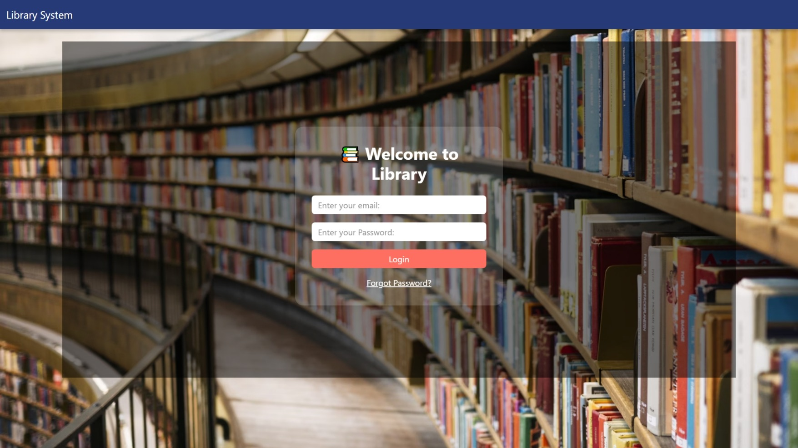
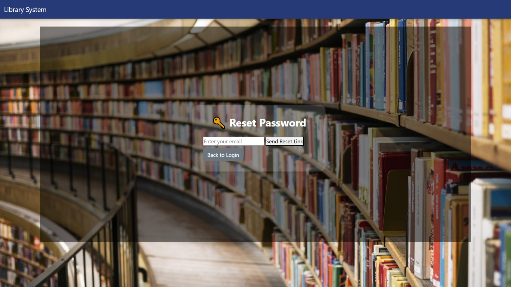
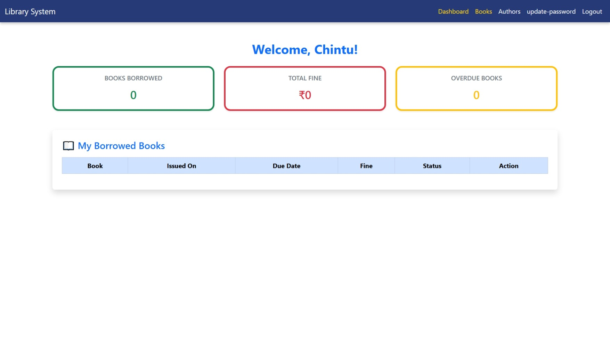
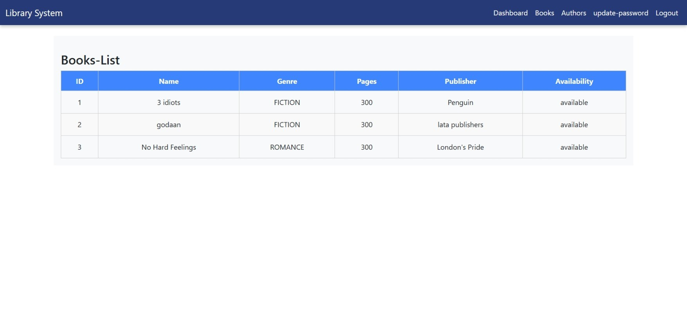
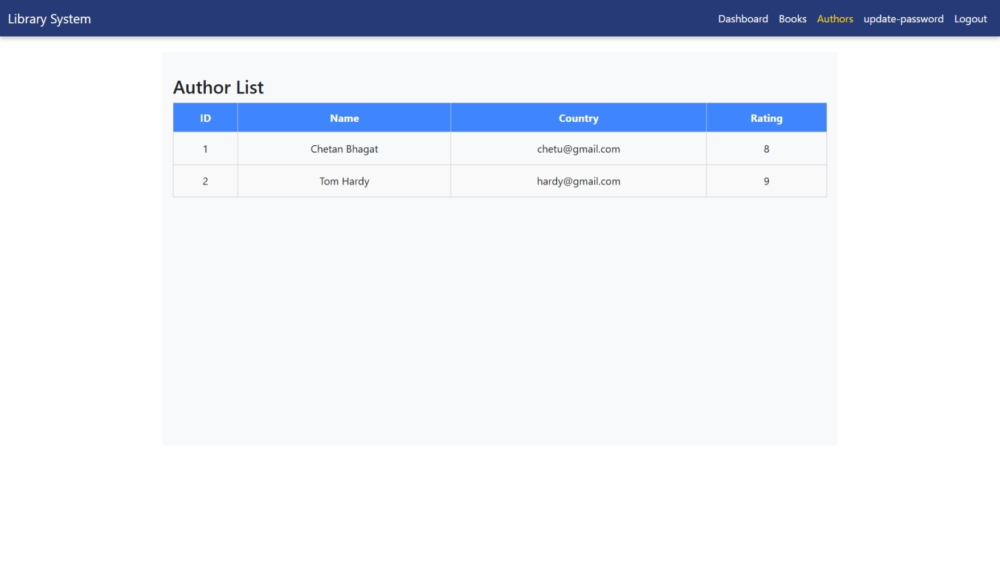
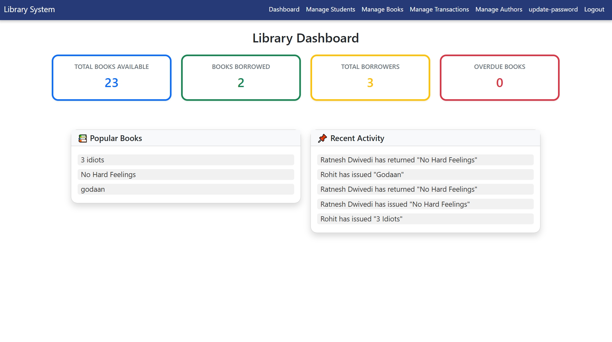
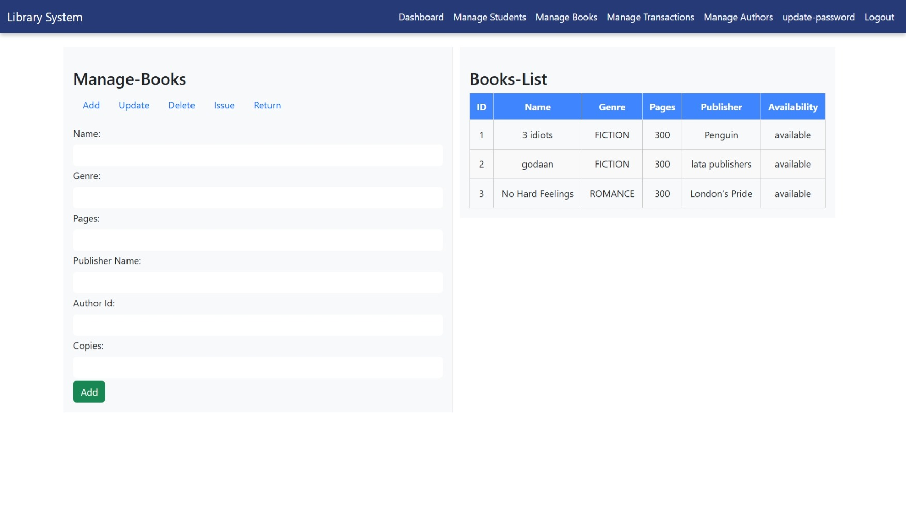
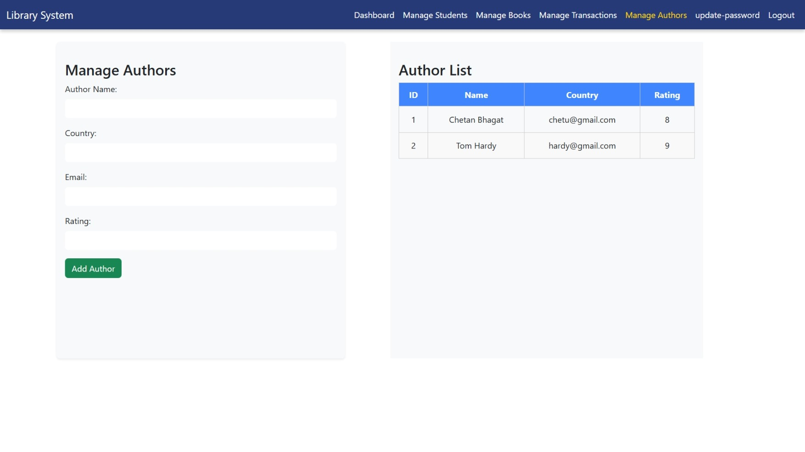
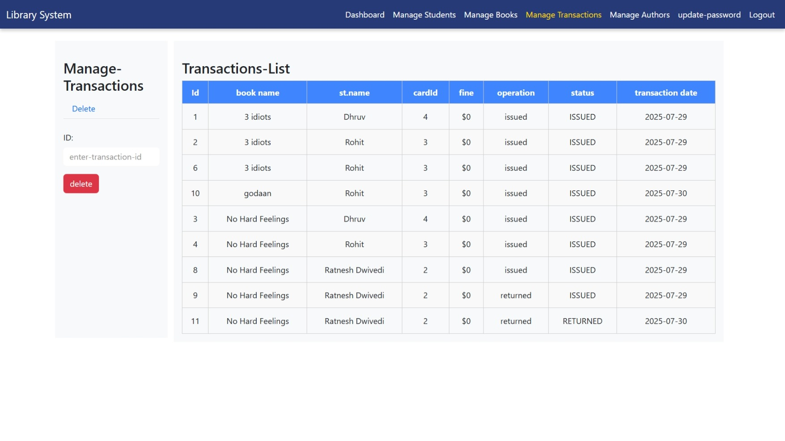

# 📚 Student Library Management System

A full-stack web application designed to digitize and streamline library operations for educational institutions. It supports **Admin** and **Student** roles with secured login, book management, issuing/returning of books, and more.

---

## 🧑‍💼 User Roles

### 🔐 Student
- 🔓 Secure login using JWT
- 👀 View borrowed books
- 📅 See issue and due dates
- 💸 View pending fines
- 🔄 Change password
- ❗ View overdue books

### 🧑‍🏫 Admin
- 🔓 Secure admin login
- 👨‍🎓 Add, view, and manage students
- 📚 Add, update, and delete books
- 🔄 Issue or return books to/from students
- 📈 Track total fines, overdue books
- 🔐 Role-based dashboard

---

## ✨ Key Features

- 🔐 **User login** with email and password
- 🧑‍⚖️ **Role-based authentication** (Student or Admin auto-detected from email)
- 🪪 **JWT token-based login system**
- 🖥️ **Separate dashboards** for Admin and Student

### 👨‍🎓 Student Features:
- View borrowed books
- View due dates and fines
- Change password
- See overdue books
- Book-Lists and details with availability 

### 🛠️ Admin Features:
- Add, view, and delete students
- Add, update, and delete books
- Issue/Return books to/from students
- View total fines and overdue book reports

### 🧰 Other Features:
- Change password with email & new temporary password sent via Email
- Forgot password flow with temporary password emailed
- Frontend with HTML, CSS, JavaScript, and Bootstrap
- Role-protected and responsive navigation
- Backend in Spring Boot with secured endpoints
- MySQL database for persistent storage
- Swagger API documentation for testing

---

## 💻 Tech Stack

| Layer     | Technology                               |
|-----------|------------------------------------------|
| Frontend  | HTML, CSS, JavaScript, Bootstrap         |
| Backend   | Java, Spring Boot, Spring Security, JPA  |
| Security  | JWT, PasswordEncoder                     |
| Database  | MySQL                                    |
| Tools     | Git, Postman, IntelliJ / VS Code         |

---

### 🔐 Login Page

### 🔁 Forgot Password (Send Reset Link)

---

## 👨‍🎓 Student Views

### 🏠 Student Dashboard

### 📚 Books

### 🔄 Authors

---

## 👩‍🏫  Admin Views

### 🏠 Admin Dashboard

### 👨‍🎓 Students

### ➕ Books

### 📘 Authors

### 🔁 Transactions

